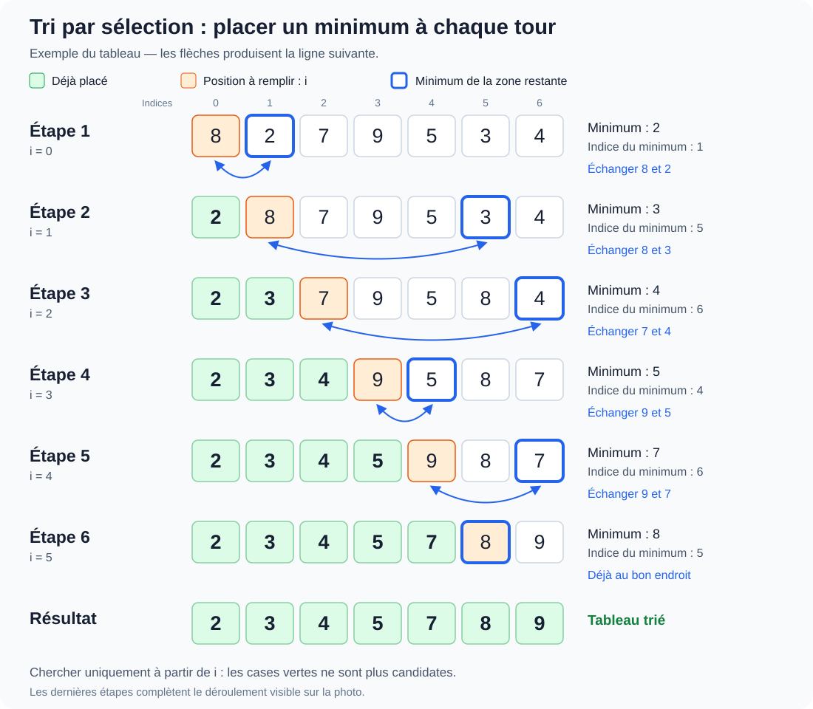
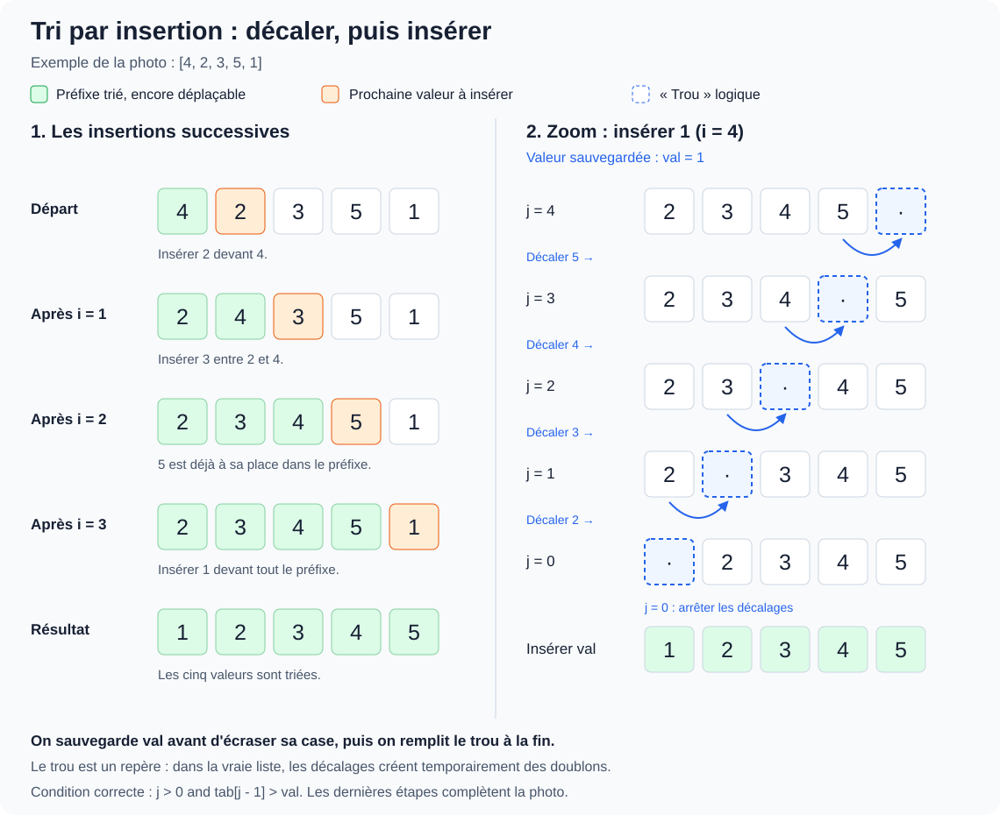
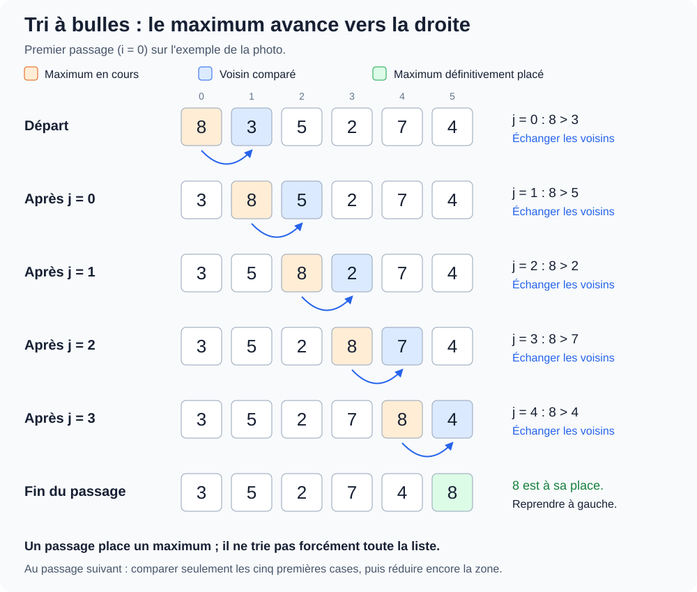

# 30 septembre — Recherche dichotomique et tris : sélection, insertion, bulles

**Analyse et résolution de problèmes · 30 septembre 2026**

[Ouvrir le notebook et exécuter les exemples](recherche_dichotomique.ipynb) · [Revoir les variants et invariants](../23.09/cours_variants.md) · [Énoncé du TD 2](../23.09/TD2_original.pdf)

**Suite de la séance :** [tri par sélection et schéma des échanges](#9-suite-de-la-séance--le-tri-par-sélection) · [Notebook du tri](tri_selection.ipynb).

**Puis :** [tri par insertion et schéma des décalages](#12-suite--le-tri-par-insertion) · [Notebook de l'insertion](tri_insertion.ipynb).

**Enfin :** [tri à bulles et schéma d'un passage](#15-suite--le-tri-à-bulles) · [Notebook des bulles](tri_bulles.ipynb).

## 1. Où en est-on dans le cours ?

**Ce que montre la première photo :** une recherche dichotomique récursive en Python, accompagnée d'une preuve de terminaison par un variant et d'une preuve de correction reposant sur un invariant.

Le dernier TD identifié dans le dossier est le **TD 2 : preuves de correction**, travaillé le 23 septembre. Ses deux pages portent sur la terminaison, les invariants, plusieurs algorithmes et le classement des élèves. **La recherche dichotomique ne figure pas dans cet énoncé.** Elle ne figure pas non plus dans la feuille d'exercices de complexité déjà présente.

Cette première partie est donc dans la continuité du thème du TD 2 ; il peut s'agir d'un exemple supplémentaire du professeur. La première photo ne permet pas d'attribuer un numéro d'exercice à la recherche dichotomique. La seconde montre ensuite le tri par sélection, qui correspond à l'exercice 2, question 3 du TD 2 : voir la section 9.

**Origine de la fiche :** le code et les idées signalées « Au tableau » viennent de la photo. Les exemples numériques, les preuves détaillées, la complexité et les questions de révision sont des compléments explicatifs. Le bas de l'écran est coupé : les essais du professeur ne sont pas entièrement lisibles.

## 2. Le problème : chercher dans un tableau trié

On cherche la valeur `val` dans un tableau `tab` **trié dans l'ordre croissant, au sens large** : deux valeurs consécutives peuvent être égales.

La fonction doit renvoyer :

- un **indice** `i` tel que `tab[i] == val`, si la valeur est présente ;
- `-1` si elle est absente.

**Exemple :** dans `[2, 5, 8, 12, 16, 23, 38]`, chercher `16` doit renvoyer `4`, et chercher `10` doit renvoyer `-1`.

Si la valeur apparaît plusieurs fois, cette version renvoie **une occurrence**, pas nécessairement la première. On suppose que les éléments et la valeur recherchée sont comparables dans un ordre total, par exemple des entiers, et que le tableau ne change pas pendant la recherche.

### L'idée de la dichotomie

Au lieu de lire toutes les cases, on compare la valeur recherchée à celle du **milieu** de la zone encore possible :

- si elles sont égales, on a trouvé ;
- si la valeur du milieu est trop grande, on cherche à gauche ;
- si elle est trop petite, on cherche à droite.

Le tri justifie l'élimination d'une moitié. Sans cette précondition, on pourrait écarter la zone contenant la valeur recherchée.

## 3. Le code visible au tableau

Les noms des fonctions et le `print(g, d)` de la projection sont conservés ; l'indentation et les espaces sont remis en forme.

```python
def recherche_dic(tab, g, d, val):
    print(g, d)
    if g > d:
        return -1
    else:
        m = (g + d) // 2
        if tab[m] == val:
            return m
        elif tab[m] > val:
            return recherche_dic(tab, g, m - 1, val)
        else:  # tab[m] < val
            return recherche_dic(tab, m + 1, d, val)


def recherche(tab, val):
    return recherche_dic(tab, 0, len(tab) - 1, val)
```

| Nom ou instruction | Signification |
| --- | --- |
| `g` | Indice de gauche de la zone de recherche. |
| `d` | Indice de droite, **inclus**. |
| `g > d` | Zone vide : il n'y a plus de case à examiner. |
| `m = (g + d) // 2` | Indice du milieu, arrondi vers le bas par la division entière. |
| `m - 1` ou `m + 1` | On exclut la case du milieu, déjà examinée. |
| `return recherche_dic(...)` | Le résultat de l'appel suivant est renvoyé jusqu'à l'appel initial. |
| `print(g, d)` | Affichage de suivi ; il ne participe pas au calcul du résultat. |

La zone d'indices de `g` à `d` inclus correspondrait à la tranche `tab[g:d+1]`. **Le programme ne construit pas cette tranche** : il conserve le même tableau et transmet seulement de nouveaux indices.

Pour un tableau vide, le premier appel utilise `g = 0` et `d = -1`. Le test `g > d` renvoie alors `-1` avant tout accès à une case.

## 4. Suivre deux exécutions

On utilise `tab = [2, 5, 8, 12, 16, 23, 38]`.

### Chercher 16 : valeur présente

| Appel | `g` | `d` | `m` | `tab[m]` | Décision |
| --- | --- | --- | --- | --- | --- |
| 1 | 0 | 6 | 3 | 12 | `12 < 16` : conserver les indices 4 à 6. |
| 2 | 4 | 6 | 5 | 23 | `23 > 16` : conserver les indices 4 à 4. |
| 3 | 4 | 4 | 4 | 16 | Égalité : renvoyer l'indice 4. |

`print(g, d)` affiche successivement `0 6`, `4 6`, puis `4 4`. L'appel le plus profond renvoie `4`, puis chaque appel en attente renvoie ce même résultat.

### Chercher 10 : valeur absente

| Appel | `g` | `d` | `m` | `tab[m]` | Décision |
| --- | --- | --- | --- | --- | --- |
| 1 | 0 | 6 | 3 | 12 | Chercher dans les indices 0 à 2. |
| 2 | 0 | 2 | 1 | 5 | Chercher dans les indices 2 à 2. |
| 3 | 2 | 2 | 2 | 8 | Chercher dans les indices 3 à 2. |
| 4 | 3 | 2 | — | — | Zone vide : renvoyer `-1`. |

Le dernier appel ne calcule pas `m`. Il faut donc vérifier que la zone est vide **avant** de lire `tab[m]`.

## 5. Prouver la terminaison : le variant

**Au tableau :** le variant proposé est `d - g`. La zone rétrécit à chaque appel récursif et on retire notamment le milieu `m`.

Tant que la zone n'est pas vide, `g <= d`, donc `d - g` est un entier **positif ou nul**. Si `g == d`, il vaut 0 : il reste encore une case à tester. Après un appel sur une zone vide, la fonction s'arrête immédiatement.

### Justifier la décroissance

Quand `g <= d`, l'indice `m = (g + d) // 2` vérifie `g <= m <= d`.

- **À gauche**, les nouvelles bornes sont `g` et `m - 1`. Le nouveau variant vaut `m - 1 - g`, au plus `d - g - 1`.
- **À droite**, les nouvelles bornes sont `m + 1` et `d`. Le nouveau variant vaut `d - m - 1`, au plus `d - g - 1`.

Dans les deux cas, il diminue strictement. Une suite infinie d'appels sur des zones non vides donnerait une suite infinie strictement décroissante d'entiers naturels, ce qui est impossible. Le cas d'égalité renvoie directement le résultat : il n'y a alors aucun nouvel appel.

### Variante de rédaction : compter les cases

On peut aussi choisir **`N = d - g + 1`**, le nombre de cases restantes. Dans les appels produits par `recherche`, les bornes vérifient `0 <= g <= d + 1 <= len(tab)` : `N` reste naturel, même pour une zone vide où il vaut 0.

Les tailles des deux zones possibles sont `m - g` et `d - m`, chacune strictement inférieure à `N`. Cette formulation évite d'avoir un variant négatif dans le dernier appel.

**Attention :** écrire seulement « on divise par deux » ne constitue pas toute la preuve. Il faut préciser la quantité, son domaine et sa décroissance, et vérifier que le milieu est exclu.

## 6. Prouver la correction : l'invariant

**Au tableau, reformulé :** si `val` est présente dans le tableau initial, une occurrence se trouve encore entre les indices `g` et `d` inclus.

La fonction est récursive. On utilise donc ici une **propriété conservée d'appel en appel**, puis un raisonnement sur les cas de retour ; il n'y a pas de boucle `while` dans le code photographié.

### Initialisation

Le premier appel porte sur les indices `0` à `len(tab) - 1`, donc sur tout le tableau. Toute occurrence éventuelle s'y trouve bien.

### Conservation grâce au tri

- Si `tab[m] > val`, toute case d'indice `i >= m` contient une valeur `tab[i] >= tab[m] > val`. Aucune occurrence ne se trouve dans cette partie : on peut conserver uniquement `[g, m - 1]`.
- Si `tab[m] < val`, toute case d'indice `i <= m` contient une valeur `tab[i] <= tab[m] < val`. On peut conserver uniquement `[m + 1, d]`.

Dans les deux cas, si la valeur existait dans la zone courante, elle existe toujours dans la nouvelle zone. Les appels conservent aussi des bornes valides, et le tableau reste inchangé.

### Conclusions aux points de retour

- **Retour de `m` :** le code vient de vérifier `tab[m] == val`, et `m` est un indice valide. Le résultat est donc un indice d'occurrence correct.
- **Retour de `-1` :** la zone est vide. Si `val` était présente dans le tableau initial, l'invariant imposerait une occurrence dans cette zone vide, ce qui est impossible. La valeur est donc absente.

La preuve de terminaison et cette preuve de correction donnent ensemble la **correction totale** de la recherche, sous les préconditions annoncées.

## 7. Complexité — complément de révision

On note `n` la taille du tableau. On compte l'accès à une case, les comparaisons et les calculs d'indices comme des opérations élémentaires, et on écarte le coût des affichages de suivi.

Chaque appel sur une zone non vide effectue un travail constant et poursuit dans une zone contenant au plus la moitié des cases. Les tailles évoluent donc comme `n`, puis au plus `n/2`, puis `n/4`, etc.

- **Meilleur cas :** Θ(1), si la valeur est trouvée au premier milieu.
- **Pire cas en temps :** Θ(log n), pour `n >= 2` ; les cas de taille 0 ou 1 prennent un temps constant.
- **Espace supplémentaire de cette version récursive :** O(log n) pour la pile d'appels.

Une version itérative, proposée en complément dans le notebook, conserve seulement les bornes et le milieu : elle utilise O(1) espace supplémentaire dans ce modèle.

Cette analyse suppose que le tableau est **déjà trié**. Un tri préalable ou une vérification complète du tri a son propre coût, à ajouter si on l'effectue. Construire des tranches à chaque appel modifierait aussi l'analyse.

## 8. Les points à savoir expliquer

1. **Pourquoi `g > d` plutôt que `g >= d` ?** Quand `g == d`, il reste une case qui peut contenir la valeur.
2. **Pourquoi `m - 1` et `m + 1` ?** Le milieu a déjà été testé ; l'exclure garantit la progression, même sur une seule case.
3. **Pourquoi un tableau trié ?** Le tri permet de déduire qu'une moitié entière ne contient pas la valeur cherchée.
4. **Pourquoi `return` devant l'appel récursif ?** Pour transmettre son résultat ; sans ce retour, un appel peut se terminer en renvoyant implicitement `None`.
5. **Peut-on utiliser directement `tab[recherche(tab, val)]` ?** Non : il faut d'abord vérifier que le résultat est différent de `-1`, car `tab[-1]` désigne la dernière case en Python.
6. **Les tests remplacent-ils la preuve ?** Non. Ils vérifient des exemples ; les preuves couvrent toutes les entrées respectant les préconditions.

## 9. Suite de la séance — Le tri par sélection

**La nouvelle photo permet de préciser le repère :** le tri par sélection correspond à l'**exercice 2, question 3 du TD 2**. On revient donc bien à un algorithme demandé dans cette feuille.

Le tableau indique la démarche : **dérouler l'algorithme à la main, le coder, puis étudier sa correction, sa terminaison et sa complexité**. Le professeur commence une fonction `indice_minimum(tab, i)`, puis `tri_selection(tab)`, dont le corps est encore vide sur la photo.

### L'idée : placer un minimum à chaque tour

À l'étape `i`, les cases situées avant `i` sont déjà à leur place. On cherche un minimum **uniquement dans la partie allant de `i` à la fin**, puis on l'échange avec la valeur de la case `i`.

La photo utilise le tableau **`[8, 2, 7, 9, 5, 3, 4]`**. Les premières lignes sont reprises ci-dessous ; la fin du déroulement est un complément calculé.



[Ouvrir le schéma en grand](tri_selection.svg)

**Lecture du schéma :** les cases vertes sont définitivement placées. La case orange est la position à remplir ; le contour bleu repère le minimum choisi dans la zone restante. La flèche représente l'échange qui produit la ligne suivante.

| Étape | Minimum de la zone restante | Action | Tableau après l'action |
| --- | --- | --- | --- |
| `i = 0` | 2, indice 1 | Échanger les indices 0 et 1. | `[2, 8, 7, 9, 5, 3, 4]` |
| `i = 1` | 3, indice 5 | Échanger les indices 1 et 5. | `[2, 3, 7, 9, 5, 8, 4]` |
| `i = 2` | 4, indice 6 | Échanger les indices 2 et 6. | `[2, 3, 4, 9, 5, 8, 7]` |
| `i = 3` | 5, indice 4 | Échanger les indices 3 et 4. | `[2, 3, 4, 5, 9, 8, 7]` |
| `i = 4` | 7, indice 6 | Échanger les indices 4 et 6. | `[2, 3, 4, 5, 7, 8, 9]` |
| `i = 5` | 8, indice 5 | Déjà à la bonne place : échange avec elle-même. | `[2, 3, 4, 5, 7, 8, 9]` |

Après avoir placé les `n - 1` premières cases, la dernière est nécessairement à sa place. Le programme ne sait pas forcément que le tableau est déjà trié plus tôt : il poursuit ses tours prévus.

### Attention à la borne dans le code projeté

Sur la photo, la fonction initialise `imin = i`, mais la boucle visible est `for k in range(len(tab))`. **Ce code est encore en cours de construction :** cette boucle parcourt tout le tableau, alors que le commentaire demande le minimum « à partir de la case i ».

Après le premier échange, on a `[2, 8, 7, 9, 5, 3, 4]`. Pour `i = 1`, chercher dans tout le tableau redonnerait l'indice 0, où se trouve 2 : l'échange casserait le début déjà trié. Il faut donc limiter la recherche à la zone restante.

On peut parcourir `range(i, len(tab))`. Comme `imin = i` prend déjà en compte cette case, la version ci-dessous commence à **`i + 1`** pour éviter une comparaison inutile.

### Code complété et corrigé

```python
def indice_minimum(tab, i):
    # Précondition : 0 <= i < len(tab).
    # Renvoie un indice du minimum parmi les cases i à len(tab)-1.
    imin = i
    for k in range(i + 1, len(tab)):
        if tab[k] < tab[imin]:
            imin = k
    return imin


def tri_selection(tab):
    for i in range(len(tab) - 1):
        imin = indice_minimum(tab, i)
        tab[i], tab[imin] = tab[imin], tab[i]
```

`indice_minimum` renvoie **l'indice**, et non la valeur minimale : cet indice permet de faire l'échange. `tri_selection` modifie la liste reçue sur place et renvoie implicitement `None`. Les listes vides et les singletons ne nécessitent aucun tour, donc aucun appel à `indice_minimum`.

**Précision de la nouvelle photo :** le professeur écrit « pas de return tab ». La version de ces notes a été alignée sur cette convention. Il faut écrire `tri_selection(tab)`, puis lire `tab`, et non `tab = tri_selection(tab)`, qui remplacerait la variable par `None`. Renvoyer aussi la liste serait un autre contrat possible, mais ce n'est pas celui retenu ici.

**Pourquoi une affectation simultanée ?** Avec `tab[i] = tab[imin]` suivi de `tab[imin] = tab[i]`, la première valeur serait perdue. L'échange simultané préserve les deux valeurs.

Le corps du tri, encore vide sur la photo précédente, est maintenant visible : une boucle, la recherche du minimum et un échange. La borne corrigée de l'auxiliaire reste celle expliquée ci-dessus.

## 10. Preuves du tri par sélection

On suppose une liste finie dont les éléments sont totalement ordonnés, par exemple des entiers. Notons `n` sa longueur et `A` son contenu initial.

### L'auxiliaire trouve bien un minimum

**Invariant de la boucle de recherche :** avant le tour d'indice `k`, `imin` désigne un minimum des cases d'indices `i` à `k - 1` inclus.

- **Initialisation :** avant le premier tour, la seule case prise en compte est `i`, et `imin = i`.
- **Conservation :** on compare `tab[k]` au minimum courant. Si elle est plus petite, on retient `k` ; sinon on garde `imin`. On connaît donc un minimum des cases allant de `i` à `k`.
- **Fin :** toutes les cases de `i` à `n - 1` ont été prises en compte. `imin` désigne le minimum recherché. Si cette zone contient une seule case, la boucle est vide et le résultat initial convient déjà.

### Le tri conserve les bonnes propriétés

**Invariant avant le tour `i` :**

1. Le préfixe `tab[:i]` est trié.
2. Chacun de ses éléments est inférieur ou égal à chaque élément de `tab[i:]`.
3. Le tableau contient exactement les éléments de `A`, avec les mêmes répétitions.

La deuxième propriété est indispensable : un préfixe trié seul ne garantit pas que ses valeurs sont déjà à leur place finale.

- **Initialisation :** le préfixe est vide et le tableau n'a pas changé.
- **Conservation :** le minimum de la zone restante vient en position `i`. Il est au moins aussi grand que les valeurs déjà placées et au plus aussi grand que les valeurs encore à droite. Le préfixe agrandi reste trié et bien placé. Un échange conserve tous les éléments.
- **Fin :** pour `n >= 2`, les `n - 1` premières cases sont placées et sont inférieures ou égales à la dernière : tout le tableau est trié. Pour `n = 0` ou `n = 1`, il l'est déjà.

### Terminaison

Les deux boucles parcourent des intervalles finis. On peut expliciter leur progression :

- boucle extérieure : le nombre de positions restant à traiter est `n - 1 - i` ;
- boucle intérieure : au début du tour `k`, le nombre de candidats encore à examiner est `n - k`.

Ces quantités sont entières et diminuent de 1 entre deux tours. Chaque recherche de minimum termine ; le tri termine donc lui aussi. La terminaison et l'invariant établissent sa correction totale.

## 11. Complexité et points à retenir

Dans cette version, la recherche du premier minimum fait `n - 1` comparaisons, la suivante `n - 2`, puis `n - 3`, jusqu'à 1. Le nombre total de comparaisons entre éléments vaut donc :

$$ (n - 1) + (n - 2) + \cdots + 1 = \frac{n(n - 1)}{2}. $$

Pour le tableau de 7 valeurs, cela donne **21 comparaisons**. Le temps est **Θ(n²)**, même si la liste est déjà triée : les recherches de minimum ont toujours lieu. L'espace supplémentaire est **O(1)**, car seules quelques variables sont utilisées.

Pour `n >= 1`, le code effectue `n - 1` instructions d'échange ; certaines échangent une case avec elle-même. Cet algorithme n'est pas stable en général : des objets de même clé peuvent changer d'ordre relatif après un échange lointain.

**À retenir :** la recherche dichotomique suppose un tableau déjà trié et réduit sa zone de recherche. Le tri par sélection, lui, produit l'ordre en plaçant successivement les minima de la zone encore non traitée.

## 12. Suite — Le tri par insertion

La nouvelle photo montre **`tri_insertion(tab)`**, qui correspond à l'**exercice 2, question 4 du TD 2**. Les éléments visibles sont une boucle sur `i`, la sauvegarde `val = tab[i]`, des décalages vers la droite et l'affectation finale `tab[j] = val`.

### L'idée : insérer une valeur dans un préfixe déjà trié

Avant le tour `i`, les cases `0` à `i - 1` sont triées. On mémorise la valeur de la case `i`, puis on décale à droite les valeurs du préfixe qui sont strictement plus grandes. La valeur mémorisée est enfin écrite dans la position libérée.

**Différence avec la sélection :** le préfixe est trié, mais ses éléments ne sont pas forcément à leur place définitive. Une petite valeur découverte plus tard peut les faire tous reculer d'une case.

### Le schéma de la photo, complété

Le tableau à droite utilise **`[4, 2, 3, 5, 1]`**. Le schéma reprend ses insertions et détaille la dernière, celle de 1.



[Ouvrir le schéma en grand](tri_insertion.svg)

| Tour | Valeur à insérer | Valeurs décalées vers la droite | Tableau après insertion |
| --- | --- | --- | --- |
| `i = 1` | 2 | 4 | `[2, 4, 3, 5, 1]` |
| `i = 2` | 3 | 4 | `[2, 3, 4, 5, 1]` |
| `i = 3` | 5 | Aucune | `[2, 3, 4, 5, 1]` |
| `i = 4` | 1 | 5, puis 4, puis 3, puis 2 | `[1, 2, 3, 4, 5]` |

Le « trou » dessiné est une **position logique**, pas une suppression réelle de case. Pendant les décalages, le tableau peut contenir temporairement des valeurs répétées. La valeur à insérer reste conservée dans `val` : c'est elle que l'on replace à la fin.

Par exemple, avec `val = 1`, le premier décalage transforme physiquement `[2, 3, 4, 5, 1]` en `[2, 3, 4, 5, 5]`. La case d'indice 3 est désormais le « trou » logique ; son ancienne valeur peut être écrasée puisque 5 a été recopié à droite.

### Code visible, avec la borne de sécurité ajoutée

```python
def tri_insertion(tab):
    for i in range(1, len(tab)):
        val = tab[i]
        j = i
        while j > 0 and tab[j - 1] > val:
            tab[j] = tab[j - 1]
            j = j - 1
        tab[j] = val
```

**Correction par rapport à l'état projeté :** la photo montre `while tab[j - 1] > val`, sans le test `j > 0`. Ce test est nécessaire pour s'arrêter au début du tableau. En Python, si `j = 0`, `tab[j - 1]` désigne la **dernière case**, pas une case située avant le tableau. Sur certaines entrées, poursuivre ainsi finit par provoquer une `IndexError`.

L'ordre des tests compte : avec `j > 0 and ...`, Python n'évalue la comparaison suivante que si `j > 0` est vrai. On ne lit donc jamais `tab[-1]` dans cette boucle corrigée.

| Instruction | Rôle |
| --- | --- |
| `range(1, len(tab))` | Le préfixe d'une seule case est déjà trié ; commencer par la deuxième valeur. |
| `val = tab[i]` | Conserver la valeur à insérer avant d'écraser sa case. |
| `j = i` | Initialiser la position disponible. |
| `tab[j] = tab[j - 1]` | Décaler une valeur trop grande vers la droite. |
| `j = j - 1` | Déplacer le « trou » logique vers la gauche. |
| `tab[j] = val` | Remplir ce trou quand la bonne position est trouvée. |

`tab[j] = val` se trouve **après le `while`**, mais reste dans le `for`. Comme le tri par sélection du professeur, ce tri modifie la liste et ne comporte aucun `return tab`.

## 13. Preuve et terminaison du tri par insertion

### Invariant de la boucle extérieure

Avant le tour `i`, **`tab[:i]` est trié et contient les mêmes éléments que le préfixe initial de longueur `i`**. Le reste n'a pas encore été modifié. On suppose toujours des éléments totalement ordonnés, par exemple des entiers.

- **Initialisation :** une seule case est déjà triée. Si la liste contient moins de deux éléments, il n'y a rien à faire.
- **Conservation :** on insère la valeur suivante sans changer les autres valeurs du préfixe, seulement leur position. Le préfixe de longueur `i + 1` devient donc trié et conserve les éléments attendus.
- **Fin :** après la dernière insertion, ce préfixe est tout le tableau : le résultat est trié et conserve les éléments de l'entrée.

### Pourquoi les décalages conservent-ils les valeurs ?

Fixons un tour `i` et appelons `B` le contenu de `tab[:i+1]` au début de ce tour. On garde `val = B[i]`. Pendant le `while` :

1. `0 <= j <= i` ; on ignore temporairement le contenu de la case `j`, le « trou » logique.
2. En retirant cette case du préfixe, les valeurs restantes sont exactement les anciennes valeurs `B[:i]`, dans leur ordre trié.
3. Toutes les valeurs situées après le trou, jusqu'à `i`, sont strictement supérieures à `val`.

Au départ, le trou est en `i`, donc ces propriétés sont vraies. Un décalage transporte le voisin gauche trop grand dans le trou, puis déplace le trou à gauche : l'ordre des autres valeurs reste inchangé.

À l'arrêt, on est soit au début (`j = 0`), soit après une valeur inférieure ou égale à `val`. À droite du trou, les valeurs sont plus grandes. Écrire `val` dans ce trou produit donc un préfixe trié, contenant exactement les éléments de `B`.

**Attention :** pendant la boucle intérieure, le tableau seul n'est pas nécessairement une permutation du tableau initial, à cause des duplications temporaires. Il faut raisonner avec la valeur sauvegardée `val` et la position ignorée `j`. La conservation complète est rétablie après l'insertion.

### Terminaison

La boucle extérieure parcourt un intervalle fini. Pour chaque tour, **`j` est un variant de la boucle intérieure** : entier naturel, il diminue de 1 à chaque décalage et le test `j > 0` empêche de descendre sous 0. Le `while` termine, puis l'insertion se termine ; le tri entier termine donc.

## 14. Complexité : préciser le cas étudié

Le tableau rapproche sélection, insertion et bulles de `n²`, puis évoque quicksort et le tri fusion pour `n log n`. Ce classement doit être précisé selon les versions et les cas.

| Algorithme | Meilleur cas | Pire cas | Précision |
| --- | --- | --- | --- |
| Sélection de ces notes | Θ(n²) | Θ(n²) | Les minima sont toujours recherchés dans toute la zone restante. |
| Insertion par décalages | Θ(n) | Θ(n²) | Une liste déjà triée ne demande aucun décalage ; une liste strictement décroissante en demande le plus. |
| Bulles | Θ(n) avec arrêt après un passage sans échange | Θ(n²) | La version sans arrêt anticipé reste quadratique même au meilleur cas. |
| Quicksort, version classique à partition en deux parties | Θ(n log n) avec partitions équilibrées | Θ(n²) | Un bon coût moyen ou espéré demande des hypothèses sur les entrées ou le choix des pivots. |
| Fusion, version classique qui divise systématiquement | Θ(n log n) | Θ(n log n) | Sur tableaux, une implémentation usuelle utilise un espace auxiliaire O(n). |

Pour l'insertion, au tour `i`, il y a au plus `i` décalages. Dans le pire cas, le total vaut `1 + 2 + ... + (n - 1) = n(n - 1)/2`. L'espace supplémentaire est **O(1)** : `i`, `j` et `val` suffisent.

Le test utilise **`>`**, et non `>=` : une valeur égale à `val` n'est pas décalée. Cette version du tri par insertion est donc **stable** : des éléments de même clé conservent leur ordre relatif.

## 15. Suite — Le tri à bulles

Cette photo montre **`tri_a_bulles(valeurs)`**, qui correspond à l'**exercice 2, question 5 du TD 2**. On a donc maintenant les trois tris demandés dans cet exercice : sélection, insertion et bulles.

### Principe : comparer les voisins de gauche à droite

On compare deux cases voisines. Si celle de gauche est plus grande, on échange leurs valeurs. En poursuivant vers la droite, un maximum de la zone parcourue finit à son extrémité droite.

Au premier passage, un maximum du tableau est placé à la fin. Au suivant, on peut ignorer cette dernière case et placer un maximum de la zone restante juste avant elle. **La partie définitivement triée grandit donc depuis la droite.**

### Code de la projection, remis en forme

```python
def tri_a_bulles(valeurs):
    n = len(valeurs)
    for i in range(n):
        for j in range(0, n - i - 1):
            if valeurs[j] > valeurs[j + 1]:
                valeurs[j], valeurs[j + 1] = valeurs[j + 1], valeurs[j]
```

Les boucles et la comparaison sont lisibles sur la photo. L'extrémité droite de la ligne d'échange est coupée ; elle est complétée ici par l'échange simultané standard, cohérent avec le début de la ligne et les flèches du tableau. La fonction modifie la liste sur place et renvoie implicitement `None`.

| Élément | Rôle |
| --- | --- |
| `i` | Numéro du passage ; au début, `i` cases de droite sont déjà placées. |
| `j` | Indice de la case gauche dans la paire comparée. |
| `j + 1` | Indice de sa voisine de droite. |
| `n - i - 1` | Borne exclue du `range` : on évite le suffixe déjà placé. |
| `>` | Échanger uniquement si les deux voisins sont dans le mauvais ordre. |

**Attention à la borne exclue :** au premier passage d'une liste de 6 cases, `range(0, 5)` donne `j = 0, 1, 2, 3, 4`. Le dernier couple comparé est donc celui d'indices 4 et 5 ; on ne lit jamais une case d'indice 6.

Le dernier tour extérieur, `i = n - 1`, possède une boucle intérieure vide. Il est inutile mais sans danger. On pourrait utiliser `range(n - 1)` pour le supprimer ; la version ci-dessus conserve le `range(n)` projeté.

### Le premier passage du tableau

L'exemple manuscrit est **`[8, 3, 5, 2, 7, 4]`**. Comme 8 est plus grand que tous les autres, il est échangé à chaque comparaison du premier passage et avance jusqu'à la dernière case.



[Ouvrir le schéma en grand](tri_bulles.svg)

Un seul passage ne trie pas tout le tableau : il donne `[3, 5, 2, 7, 4, 8]`. Seul le maximum final est alors garanti à sa place.

### Les passages suivants — complément calculé

| Passage `i` | Comparaisons de voisins | État après le passage | Suffixe garanti en place |
| --- | --- | --- | --- |
| 0 | 5 | `[3, 5, 2, 7, 4, 8]` | `[8]` |
| 1 | 4 | `[3, 2, 5, 4, 7, 8]` | `[7, 8]` |
| 2 | 3 | `[2, 3, 4, 5, 7, 8]` | `[5, 7, 8]` |
| 3 | 2 | `[2, 3, 4, 5, 7, 8]` | `[4, 5, 7, 8]` |
| 4 | 1 | `[2, 3, 4, 5, 7, 8]` | Tout le tableau est alors garanti trié. |
| 5 | 0 | `[2, 3, 4, 5, 7, 8]` | Dernier tour vide. |

Le tableau est déjà trié après le passage 2, mais cette version ne le détecte pas : elle effectue encore les comparaisons prévues.

## 16. Prouver le tri à bulles

On suppose une liste finie d'éléments totalement ordonnés, par exemple des entiers. Comme pour la sélection, les seuls changements sont des échanges : ils conservent les valeurs et leurs répétitions.

### Invariant de la boucle intérieure

Avant la comparaison d'indice `j`, **`valeurs[j]` est un maximum des cases `0` à `j`**. Au départ, pour `j = 0`, c'est immédiat.

La comparaison entre `valeurs[j]` et `valeurs[j + 1]`, suivie si nécessaire d'un échange, place le plus grand des deux en `j + 1`. Cette case contient donc maintenant un maximum des cases `0` à `j + 1`.

À la fin du passage, un maximum de toute la zone active est placé en `n - i - 1`. Il peut y avoir plusieurs occurrences du maximum ; en placer une suffit.

### Invariant de la boucle extérieure

Avant le passage `i` :

1. Le suffixe `valeurs[n - i:]` est trié.
2. Chaque valeur de ce suffixe est supérieure ou égale à chaque valeur de la zone active `valeurs[:n - i]`.
3. La liste contient les mêmes éléments qu'au départ, avec les mêmes répétitions.

- **Initialisation :** pour `i = 0`, le suffixe est vide et rien n'a changé.
- **Conservation :** le passage place à sa droite un maximum de la zone active. Cette valeur est au plus égale aux valeurs du suffixe déjà placé. Elle peut donc le rejoindre par la gauche en conservant son ordre. Les échanges préservent les éléments.
- **Fin :** après les `n - 1` passages utiles, il reste au plus une case active, inférieure ou égale à toutes les suivantes : tout le tableau est trié. Le dernier tour vide ne change rien. Les listes vides et les singletons sont déjà triés.

### Terminaison

Les deux boucles parcourent des `range` finis. Pour un passage fixé, le nombre de comparaisons restant à faire est **`n - i - 1 - j`** au début du tour `j` ; il diminue de 1. Le nombre de tours extérieurs restants est **`n - i`** au début du passage `i` ; il diminue également de 1.

Chaque passage termine et le nombre de passages est fini : le tri termine. Avec l'invariant, cela établit sa correction totale.

## 17. Coût du code projeté et optimisation possible

Le nombre de comparaisons de valeurs est fixé par les bornes des boucles :

$$ (n - 1) + (n - 2) + \cdots + 1 = \frac{n(n - 1)}{2}. $$

Pour les 6 valeurs de l'exemple, cela donne **15 comparaisons**. Les échanges, eux, dépendent de l'ordre initial : une comparaison n'entraîne pas forcément un échange.

- **Version photographiée :** Θ(n²) en temps au meilleur comme au pire cas, puisqu'aucun arrêt anticipé n'est prévu.
- **Espace supplémentaire :** O(1), hors affichages et historique ajoutés pour étudier le programme.
- **Stabilité :** oui, avec la comparaison stricte `>` ; deux éléments de même clé ne sont pas échangés entre eux.

**Optimisation possible, non visible dans le code photographié :** mémoriser si un échange a eu lieu pendant le passage. Si aucun échange n'a eu lieu, toutes les paires de voisins de la zone active sont déjà dans l'ordre ; avec le suffixe placé, la liste entière est triée et on peut s'arrêter. Cette variante a un meilleur cas Θ(n), mais conserve un pire cas Θ(n²).

**Ne pas mélanger les versions :** on ne peut pas attribuer le meilleur cas linéaire au code de la photo tant qu'on n'y ajoute pas ce mécanisme d'arrêt.
