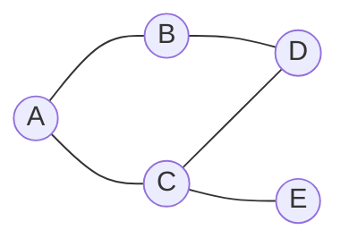

# 28 septembre — Graphes, parcours, listes Python et routage

**Objectif : comprendre comment explorer un graphe, choisir les bonnes structures de données et appliquer ces idées aux réseaux.**

Cette fiche développe les thèmes de tes notes de séance. Les exemples et corrections sont des compléments de révision. Pour les bases sur les adresses IP et les réseaux, voir les [prérequis du 21 septembre](../21.09/note.md).

## 1. Graphes, connexité et arbres

Un **graphe** représente des objets par des **sommets** et des relations par des **arêtes**. Dans un graphe orienté, les relations ont un sens : on parle d’**arcs**. Un chemin suit des liaisons successives ; dans un graphe orienté, il doit respecter le sens des arcs.

| Notion | Définition à retenir |
| --- | --- |
| Graphe non orienté **connexe** | Toute paire de sommets est reliée par un chemin. |
| **Composante connexe** | Groupe maximal de sommets reliés entre eux par des chemins. |
| Graphe orienté **fortement connexe** | Pour tous sommets `u` et `v`, il existe un chemin orienté de `u` vers `v` et un autre de `v` vers `u`. |
| Graphe orienté **faiblement connexe** | Le graphe devient connexe lorsqu’on oublie le sens des arcs. |
| **Cycle** | Trajet fermé, sans répétition d’arête ni de sommet autre que le départ à l’arrivée ; dans un graphe orienté, les arcs sont parcourus dans leur sens. |
| **Arbre** | Graphe non orienté, non vide, connexe et sans cycle. |
| **Forêt** | Graphe non orienté sans cycle : chacune de ses composantes connexes est un arbre. |

**Exemples :** `A → B → C` est faiblement connexe, mais pas fortement connexe : C ne peut pas revenir vers A. En ajoutant `C → A`, on obtient un graphe fortement connexe.

Dans un arbre, il existe **un unique chemin simple** entre deux sommets. Un arbre fini à `n` sommets possède `n - 1` arêtes. Attention : avoir `n - 1` arêtes ne suffit pas à prouver qu’un graphe quelconque est un arbre ; il faut aussi, par exemple, établir sa connexité.

Un **arbre enraciné** possède en plus un sommet désigné comme racine. Les notions de parent et d’enfant découlent de ce choix. Un arbre n’est pas nécessairement binaire : un sommet peut avoir plus de deux enfants.

## 2. Deux parcours : profondeur et largeur

Le terme attendu dans les notes est **parcours en profondeur**, et non « parcours en longueur ».

| | Parcours en profondeur — DFS | Parcours en largeur — BFS |
| --- | --- | --- |
| Idée | Continuer dans une branche avant de revenir en arrière. | Explorer les sommets par distance croissante depuis le départ. |
| Structure | Une pile, explicite ou fournie par les appels récursifs. | Une file. |
| Ordre de traitement | Dernier arrivé, premier traité : **LIFO**. | Premier arrivé, premier traité : **FIFO**. |
| Applications | Accessibilité, composantes connexes, cycles ; tri topologique d’un graphe orienté sans cycle. | Distances en nombre d’arêtes, plus courts chemins non pondérés, test de bipartition. |

Les deux parcours peuvent servir à déterminer quels sommets sont accessibles. **Seul BFS garantit ici la découverte par distance croissante en nombre d’arêtes.** Avec des poids différents, cette distance ne représente pas forcément le coût minimal.

### Un exemple commun



Le graphe est non orienté. Ses arêtes sont `A—B`, `A—C`, `B—D`, `C—D`, `C—E`. Il est connexe mais ce n’est pas un arbre : il contient le cycle `A—B—D—C—A`.

On le représente par des **listes de voisins** :

```python
graphe = {
    "A": ["B", "C"],
    "B": ["A", "D"],
    "C": ["A", "D", "E"],
    "D": ["B", "C"],
    "E": ["C"],
}
```

Chaque arête figure dans les deux sens. L’ordre des voisins détermine l’ordre précis de visite lorsqu’il y a plusieurs choix. Les codes suivants supposent que tous les voisins sont également des clés du dictionnaire.

### Parcours en profondeur récursif

```python
def profondeur(graphe, depart):
    visites = set()
    ordre = []

    def visiter(sommet):
        visites.add(sommet)
        ordre.append(sommet)
        for voisin in graphe[sommet]:
            if voisin not in visites:
                visiter(voisin)

    visiter(depart)
    return ordre

print(profondeur(graphe, "A"))  # ['A', 'B', 'D', 'C', 'E']
```

Depuis A, on entre dans B, puis D, puis C, puis E. Lorsqu’un sommet n’a plus de voisin à explorer, l’appel se termine et on revient à l’appel précédent. La récursion joue donc le rôle d’une pile.

Le marquage dans `visites` a lieu **avant** d’explorer les voisins. Sans lui, on pourrait revenir indéfiniment entre A et B. Pour de très grands graphes, la profondeur des appels peut dépasser la limite de récursion de Python ; une pile explicite permet d’éviter cette limite.

### Parcours en largeur avec une file

```python
from collections import deque

def largeur(graphe, depart):
    file = deque([depart])
    distance = {depart: 0}
    parent = {depart: None}
    ordre = []

    while file:
        sommet = file.popleft()
        ordre.append(sommet)
        for voisin in graphe[sommet]:
            if voisin not in distance:
                distance[voisin] = distance[sommet] + 1
                parent[voisin] = sommet
                file.append(voisin)

    return ordre, distance, parent

ordre, distance, parent = largeur(graphe, "A")
print(ordre)     # ['A', 'B', 'C', 'D', 'E']
print(distance)  # {'A': 0, 'B': 1, 'C': 1, 'D': 2, 'E': 2}
```

`distance` sert aussi de marquage : un sommet est considéré comme découvert **dès son entrée dans la file**. Ainsi, D, découvert depuis B, n’est pas ajouté une seconde fois depuis C.

| Sommet retiré | File après traitement des voisins | Nouvelles découvertes |
| --- | --- | --- |
| A | B, C | B et C, distance 1 |
| B | C, D | D, distance 2 |
| C | D, E | E, distance 2 |
| D | E | Aucune |
| E | Vide | Aucune |

Pour reconstruire un chemin vers E, suivre les parents : `E ← C ← A`, puis inverser l’ordre. Cela donne `A → C → E`. Si un sommet n’apparaît pas dans `distance`, il est inaccessible depuis le départ.

### Pourquoi BFS donne-t-il les plus courts chemins non pondérés ?

La file traite tous les sommets de distance 0, puis ceux de distance 1, puis ceux de distance 2, etc. Quand on découvre un voisin d’un sommet de distance `d`, on lui attribue `d + 1`. Un chemin plus court l’aurait fait découvrir dans une couche précédente.

Sur un graphe fini représenté par listes de voisins, DFS et BFS traitent chaque sommet accessible une seule fois et examinent ses voisins. Pour parcourir tout le graphe, leur coût est **O(V + E)**, où `V` est le nombre de sommets et `E` le nombre d’arêtes, en supposant les opérations usuelles de dictionnaire et d’ensemble en temps constant en moyenne. L’espace supplémentaire est O(V).

Un seul départ ne couvre pas forcément tout le graphe. Pour parcourir plusieurs composantes, on relance l’exploration depuis chaque sommet encore non visité, avec un marquage partagé.

## 3. Exercices d’application des parcours

### Détecter un cycle avec DFS

**Dans un graphe simple non orienté**, on mémorise le parent de chaque sommet pendant DFS. Si un sommet a un voisin déjà visité qui n’est pas son parent, on a détecté un cycle.

Pourquoi exclure le parent ? L’arête `A—B` apparaît dans les deux listes de voisins. Revenir de B vers son parent A ne forme pas à lui seul un cycle. Dans notre exemple, le parcours `A → B → D → C` rencontre depuis C le sommet A déjà visité, qui n’est pas son parent D : cela révèle le cycle.

**Dans un graphe orienté**, « voisin déjà visité » ne suffit pas. On distingue généralement trois états : non découvert, en cours d’exploration, terminé. Un arc vers un sommet **en cours d’exploration**, encore dans la pile des appels, révèle un cycle orienté. Un arc vers un sommet terminé n’en prouve pas l’existence.

**Contre-exemple :** avec `A → B`, `A → C` et `C → B`, on peut rencontrer B depuis C après avoir terminé B, alors qu’il n’y a aucun cycle orienté.

Autres exercices possibles avec DFS : trouver les composantes connexes d’un graphe non orienté ; chercher une sortie dans un labyrinthe ; ordonner des tâches par dépendances si le graphe orienté est sans cycle. Pour un tri topologique, il faut exploiter l’ordre de fin des visites, pas simplement l’ordre de découverte.

### Colorier avec BFS : le cas de deux couleurs

La mention « coloriage » peut désigner plusieurs problèmes. Ici, on développe le **test de bipartition** : peut-on attribuer deux couleurs aux sommets d’un graphe non orienté, sans que deux voisins aient la même couleur ? Ce n’est pas un algorithme général de coloriage avec un nombre quelconque de couleurs.

On donne la couleur 0 au départ, puis la couleur opposée à chaque nouveau voisin. Si une arête relie deux sommets de même couleur, deux couleurs ne suffisent pas.

```python
def est_biparti(graphe):
    couleurs = {}
    for depart in graphe:  # Traiter aussi les composantes séparées.
        if depart in couleurs:
            continue
        couleurs[depart] = 0
        file = deque([depart])
        while file:
            sommet = file.popleft()
            for voisin in graphe[sommet]:
                if voisin not in couleurs:
                    couleurs[voisin] = 1 - couleurs[sommet]
                    file.append(voisin)
                elif couleurs[voisin] == couleurs[sommet]:
                    return False
    return True

print(est_biparti(graphe))  # True
```

**Correction sur notre exemple :** A, D et E peuvent recevoir la couleur 0 ; B et C la couleur 1. Chaque arête relie deux couleurs différentes.

**Et pour un triangle ?** Si A a la couleur 0, ses voisins B et C doivent avoir la couleur 1. L’arête B—C crée alors un conflit. Un graphe non orienté est biparti si et seulement s’il ne contient aucun cycle de longueur impaire. Un cycle de longueur paire, comme celui de notre exemple, n’empêche donc pas la bipartition.

## 4. Les listes Python : capacité, décalages et coût

### Une liste ne recopie pas tous ses objets à chaque modification

Dans **CPython**, une `list` repose sur un tableau dynamique de **références vers les objets**. Sa longueur est le nombre d’éléments présents ; sa capacité correspond aux emplacements réservés. Supprimer une case au milieu décale les références suivantes pour combler le trou, sans copier en profondeur les objets. Supprimer à la fin n’impose pas ce décalage.

Pour grandir, CPython réserve généralement un peu de place supplémentaire. Dans la version 3.13, la croissance par ajouts successifs suit notamment `0, 4, 8, 16, 24, 32, 40, 52…` : **ce n’est pas un doublement systématique**. Pour les grandes tailles, la surallocation est d’environ un huitième, avec des ajustements. Ce détail dépend de l’implémentation. [Source : code de CPython 3.13, `list_resize`](https://github.com/python/cpython/blob/3.13/Objects/listobject.c).

### Pourquoi parle-t-on parfois de doublement ?

Pour expliquer les tableaux dynamiques en algorithmique, on utilise souvent un modèle simplifié : quand le tableau est plein, on réserve le double de sa capacité et on recopie les références. Ce modèle illustre le principe, sans décrire exactement CPython.

Dans ce modèle, les copies lors des agrandissements ont des tailles `1, 2, 4, 8, …`. Leur somme reste proportionnelle au nombre total d’ajouts. On peut donc avoir quelques ajouts coûteux, tout en gardant un **coût amorti constant** : le coût total d’une longue suite de `n` ajouts est O(n). « Amorti » ne signifie pas que chaque ajout individuel coûte exactement le même temps.

### Les coûts utiles pour choisir une structure

On note `n` la longueur de la liste. Les coûts concernent la gestion du conteneur, en supposant les comparaisons et les opérations sur les éléments élémentaires.

| Opération | Coût usuel | Explication |
| --- | --- | --- |
| `len(t)` ou `t[i]` | O(1) | Taille mémorisée ou accès direct. |
| `t.append(x)` | O(1) amorti | Agrandissement occasionnel. |
| `t.pop()` | O(1) amorti | Retrait à la fin ; réduction de capacité occasionnelle. |
| `t.pop(0)` | O(n) | Décalage des éléments suivants. |
| `del t[i]` | O(n) dans le pire cas | Décalage de la fin de la liste. |
| `t.remove(x)` | O(n) dans le pire cas | Recherche de la première occurrence, puis suppression. |
| `t[1:]` | O(n) | Création d’une nouvelle liste de références. |

**Exemple :** supprimer B de `[A, B, C, D]` donne `[A, C, D]`. Les références vers C et D changent de case. Les objets C et D ne sont pas recréés pour autant.

### Conséquence directe pour BFS

Une file faite avec `list.append` et `list.pop(0)` impose des décalages répétés. Sur certains graphes, ces opérations peuvent ajouter un coût quadratique au parcours.

`collections.deque` permet d’ajouter à droite avec `append` et de retirer à gauche avec `popleft`, avec un coût d’environ O(1) pour ces opérations. C’est pourquoi le code de BFS utilise une `deque`. Une liste convient en revanche bien à une pile avec `append` et `pop()` à la fin. [Documentation officielle de `deque`](https://docs.python.org/3.13/library/collections.html#collections.deque).

## 5. Routage : lire une table et comprendre les protocoles

Un **routeur** transmet des paquets entre réseaux. Pour décider où envoyer un paquet, il consulte notamment son adresse IP de destination et sa table de routage.

### Que contient une table de routage ?

| Information | Rôle |
| --- | --- |
| Préfixe destination | Réseau ou ensemble d’adresses concerné, par exemple `192.168.2.0/24`. |
| Prochain saut | Adresse du routeur voisin auquel transmettre le paquet, si la destination n’est pas directement connectée. |
| Interface de sortie | Interface locale par laquelle le paquet doit partir. |
| Selon l’affichage : métrique, origine, préférence… | Informations pour comparer ou identifier les routes. |

**Exemple simplifié :** R1 est connecté au réseau local `192.168.1.0/24` par `eth0` et à un réseau de transit `10.0.0.0/30` par `eth1`. R2, voisin sur ce réseau de transit, possède l’adresse `10.0.0.2`.

| Destination | Prochain saut | Interface |
| --- | --- | --- |
| `192.168.1.0/24` | Directement connecté | `eth0` |
| `10.0.0.0/30` | Directement connecté | `eth1` |
| `192.168.2.0/24` | `10.0.0.2` | `eth1` |

Pour joindre `192.168.2.20`, R1 envoie à R2 par `eth1`. Le prochain saut n’est pas la destination finale du paquet. Lorsque plusieurs préfixes correspondent, on choisit le plus spécifique ; une route `0.0.0.0/0` constitue une route par défaut. [Référence : RFC 1812, sélection de route](https://datatracker.ietf.org/doc/html/rfc1812#section-5.2.4.3).

Il faut distinguer **construire et mettre à jour les routes**, puis **utiliser la table pour acheminer les paquets**. Les protocoles de routage participent à la première opération ; on ne relance pas nécessairement un calcul complet pour chaque paquet.

### RIP — Routing Information Protocol

RIP est un protocole à **vecteur de distances** : les routeurs échangent avec leurs voisins des informations sur les destinations connues et leur distance. Il s’appuie sur le principe de Bellman-Ford distribué.

Avec la métrique usuelle en nombre de sauts, il privilégie les trajets comportant le moins de sauts. Un routeur compare les distances annoncées, en ajoutant le coût pour passer par le voisin. Dans RIPv2, les métriques utilisables vont de 1 à 15 ; **16 signifie inaccessible**. [Référence : RFC 2453](https://datatracker.ietf.org/doc/html/rfc2453).

### OSPF — Open Shortest Path First

OSPF est un protocole à **état de liens** : des informations sur les liaisons sont diffusées afin que les routeurs disposent d’une représentation de la topologie dans leur aire. Chaque routeur utilise **Dijkstra** pour calculer les chemins de coût minimal depuis lui-même.

Dans le cas simple étudié ici, le coût d’un trajet est la somme des coûts de ses liaisons. Ces coûts sont configurables. Un exercice peut les définir à partir des débits, mais un coût OSPF n’est pas automatiquement une durée mesurée. [Référence : RFC 2328](https://datatracker.ietf.org/doc/html/rfc2328).

RIP et OSPF sont **deux protocoles étudiés**, pas les deux seuls protocoles de routage existants.

### Exemple : moins de sauts ou moins de coût ?

Considérons un autre graphe non orienté, composé uniquement des liaisons `A—D` de coût 10, `A—B` de coût 1, `B—C` de coût 1 et `C—D` de coût 1.

| Chemin de A à D | Nombre de liaisons | Coût total |
| --- | --- | --- |
| `A → D` | 1 | 10 |
| `A → B → C → D` | 3 | 3 |

Le premier trajet minimise les sauts ; le second minimise le coût. Avec ces critères, le prochain saut depuis A est donc D dans le premier cas et B dans le second. Pour une destination réseau, respecter la convention de comptage des sauts donnée dans l’énoncé.

### Dijkstra, en quatre étapes

1. Initialiser la distance du départ à 0 et les autres à l’infini.
2. Parmi les sommets non fixés, choisir celui de plus petite distance provisoire.
3. Essayer d’améliorer la distance de chaque voisin en passant par ce sommet : comparer la distance connue à `distance du sommet + coût de la liaison`.
4. Fixer la distance du sommet traité et recommencer jusqu’à avoir traité les sommets accessibles, ou fixé la destination recherchée.

Pour l’exemple ci-dessus, après A on connaît B à 1 et D à 10. Après B, on découvre C à 2. Après C, on améliore D à 3. D n’est donc pas fixé lorsqu’on le découvre pour la première fois.

Dijkstra demande des **poids positifs ou nuls** pour sa garantie habituelle. BFS convient quand on compte simplement les arêtes ; DFS ne garantit pas le plus court chemin.

## 6. Questions de révision

1. Pourquoi `A → B → C` n’est-il pas fortement connexe ? **Il n’existe pas de chemin orienté de C vers A.**
2. Pourquoi le parcours doit-il marquer les sommets ? **Pour ne pas les explorer plusieurs fois et éviter de boucler sur les cycles.**
3. Pourquoi un voisin déjà visité ne prouve-t-il pas toujours un cycle ? **Il peut être le parent en non orienté, ou un sommet déjà terminé en orienté.**
4. Peut-on colorier un triangle avec deux couleurs sans conflit ? **Non : ses trois sommets sont voisins deux à deux.**
5. Pourquoi éviter `pop(0)` pour la file de BFS ? **Il décale les éléments restants à chaque retrait.**
6. Les listes Python doublent-elles toujours de capacité ? **Non. Le doublement est un modèle pédagogique ; CPython utilise une autre politique de surallocation.**
7. Quelle différence entre RIP et OSPF retenir ici ? **Le critère de choix et les informations échangées : distances aux voisins pour RIP, état des liaisons et calcul par Dijkstra pour OSPF.**
